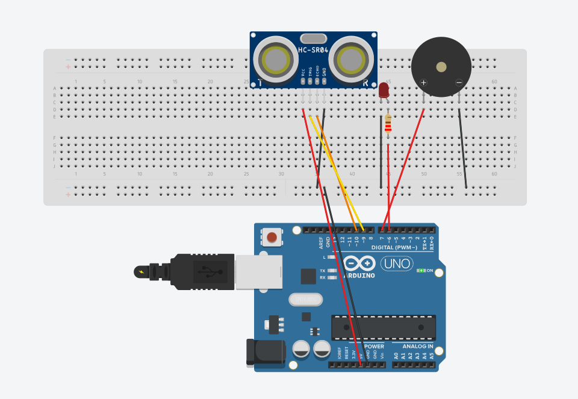
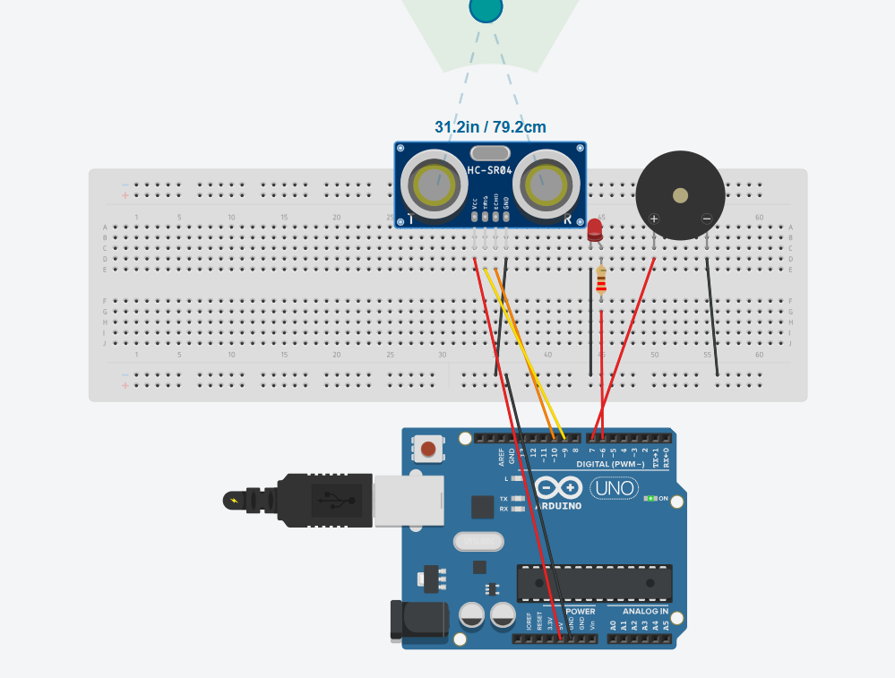
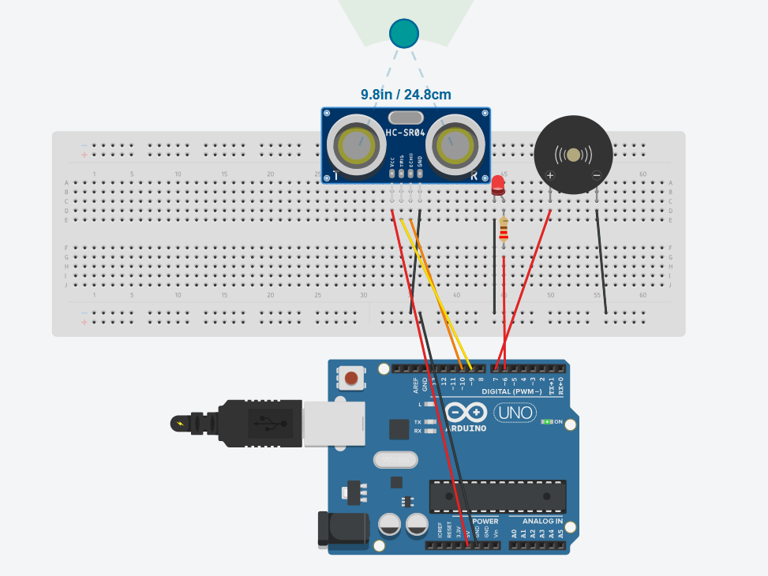
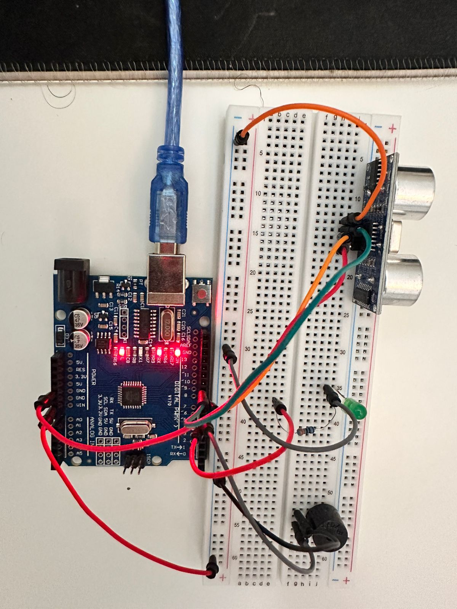
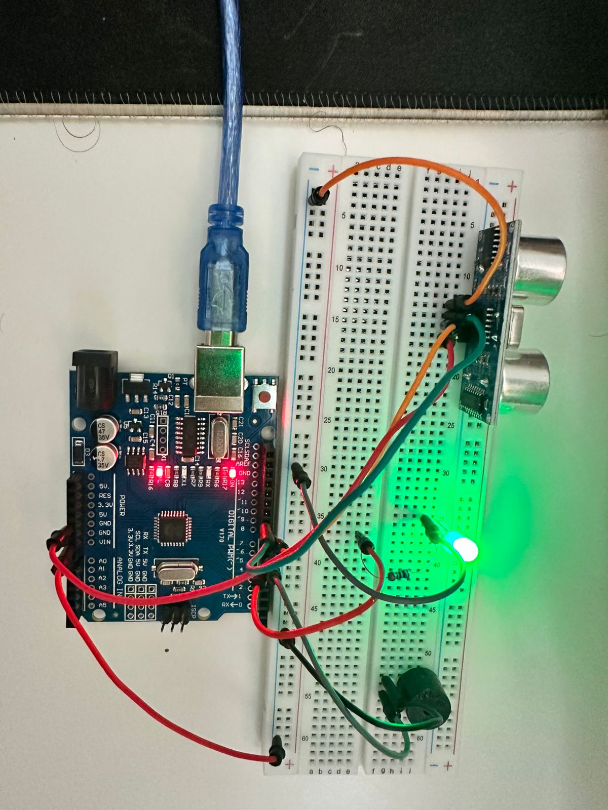

# Intelligent Intrusion & Perimeter Monitor

A compact, low-cost Arduino-based embedded system that uses an HC-SR04 ultrasonic sensor to monitor a nearby zone and provide visual and audible alerts.

## Overview

The system measures distance continuously and classifies the current condition into four firmware states:

- `NORMAL` — no nearby object detected within the configured warning range.
- `WARNING` — an object is detected within the warning range.
- `INTRUSION` — the filtered distance crosses the intrusion threshold and the event is confirmed across multiple samples.
- `SENSOR_FAULT` — repeated invalid ultrasonic readings are detected.

The project was implemented on an Arduino Uno and validated through both Tinkercad simulation and physical hardware.

## Features

- HC-SR04 ultrasonic distance measurement
- Five-sample moving-average filtering
- Finite State Machine (FSM) for system-state management
- Intrusion confirmation using consecutive samples
- Ultrasonic sensor validation and fault handling
- LED and buzzer status indication
- Serial monitoring over USB
- Tinkercad simulation
- Physical hardware prototype

## Hardware

- Arduino Uno
- HC-SR04 Ultrasonic Sensor
- LED
- 220 Ω resistor
- Buzzer
- Breadboard
- Jumper wires

## Pin Configuration

| Component | Arduino Pin |
|---|---:|
| HC-SR04 TRIG | D9 |
| HC-SR04 ECHO | D10 |
| LED | D6 |
| Buzzer | D7 |
| HC-SR04 VCC | 5V |
| HC-SR04 GND | GND |

## Firmware Architecture

```text
HC-SR04
   |
   v
Raw Distance Measurement
   |
   v
Sensor Validation
   |
   v
Moving Average Filter
   |
   v
Intrusion Confirmation
   |
   v
Finite State Machine
   |
   +-------------------+
   |                   |
   v                   v
 LED Output        Buzzer Output
```

## Detection Logic

The prototype uses these configured values:

- Warning threshold: `10 cm`
- Intrusion threshold: `5 cm`
- Intrusion confirmation: `3` consecutive intrusion-level samples
- Filter window: `5` samples
- Sensor sampling interval: `200 ms`
- Valid ultrasonic range: `2–400 cm`
- Sensor-fault threshold: `3` consecutive invalid readings

These values are intentionally configured for a small prototype and can be adjusted in the firmware.

## Simulation

### Normal



### Warning



### Intrusion



## Physical Hardware

### Hardware Setup



### Intrusion State



## Tools

- Arduino IDE
- Tinkercad Circuits

## Project Structure

```text
intelligent-intrusion-monitor/
|
|-- README.md
|-- LICENSE
|
|-- src/
|   `-- intelligent_intrusion_monitor.ino
|
|-- simulation/
|   |-- normal.png
|   |-- warning.png
|   `-- intrusion.png
|
|-- hardware/
|   |-- setup.jpg
|   `-- intrusion.jpg
|
`-- docs/
    `-- circuit_diagram.pdf
```

## Learning Outcomes

This project covers practical Arduino and embedded-firmware concepts including GPIO, ultrasonic sensing, sensor data filtering, finite state machines, event confirmation, non-blocking timing with `millis()`, serial debugging, and basic sensor fault handling.

## License

MIT License — see [LICENSE](LICENSE).
